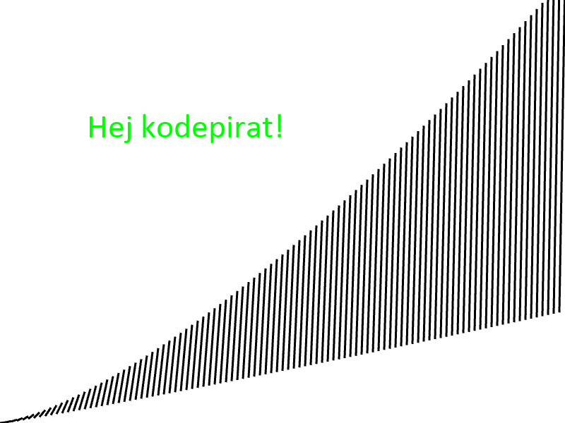

# Python med arcade-biblioteket

## Installation

For at kode Python skal du først installere nogle ting:

1. Installér Visual Studio Code: https://code.visualstudio.com/ (medmindre du allerede er vant til at skrive kode i noget andet)
2. Installér Python **version 3.11** (version vigtigt for at arcade kan virke): https://www.python.org/downloads/
3. Installér arcade: Åbn Visual Studio Code, åbn en ny terminal deri, og kør `pip install arcade` (alternativt: <https://api.arcade.academy/en/latest/install/index.html>)


## Få vist noget på skærmen

Nu skal du se om Python virker ved at prøve at skrive noget Python-kode for at tegne lidt på din skærm.

Lav en ny fil i Visual Studio Code og indsæt al denne kode:

```python
# Importér arcade
import arcade

# Lav et vindue
arcade.open_window(800, 600, "Tegn linjer")
arcade.set_background_color(arcade.color.WHITE)
arcade.start_render()

# Tegn i vinduet
for i in range(100):
    arcade.draw_line(i * 8, i ** 1.1, (i + 1) * 8, (i + 1) ** 1.4, arcade.color.BLACK, 3)
arcade.draw_text("Hej kodepirat!", 123, 405, arcade.color.GREEN, 36)

# Bliv ved med at holde vinduet åbent indtil du lukker det
arcade.finish_render()
arcade.run()
```

Det skal gerne se sådan her ud hvis det virker:



Prøv at ændre nogle af tallene og se hvad der sker.  Det er ikke så vigtigt hvad de gør, bare prøv at ændre det billede du får.


## Flere guides

- Følg Platformer-tutorial (engelsk): https://api.arcade.academy/en/latest/examples/platform_tutorial/index.html
- Se indbyggede resourcer: https://api.arcade.academy/en/latest/resources.html
