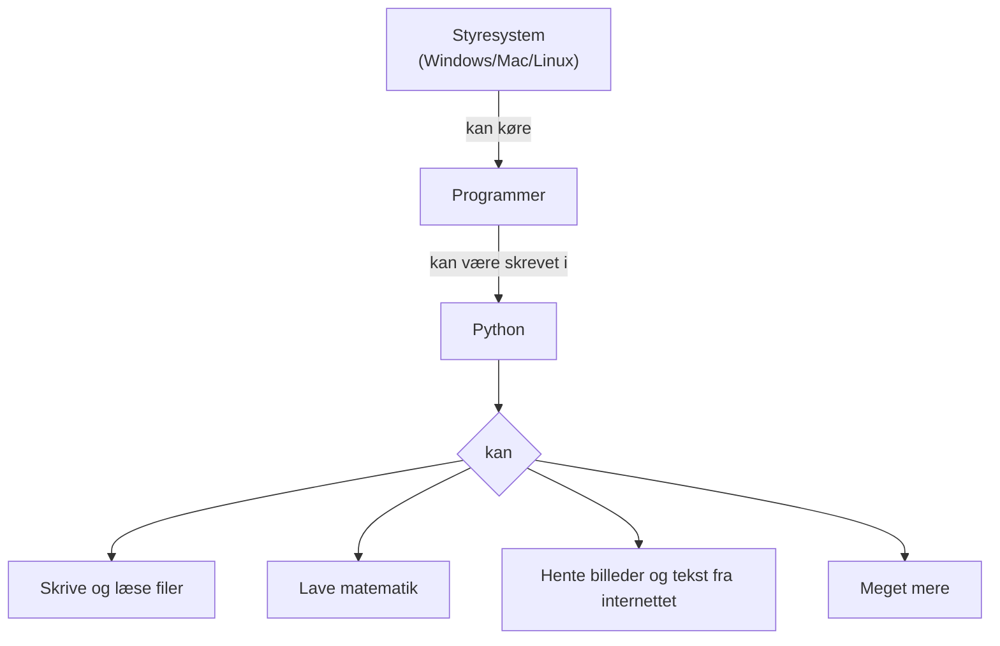

# Python og styresystemet



Et styresystem (engelsk: operating system) er den del i din computer der
sørger for at alting kører. Hvis du ikke havde et styresystem, ville du
ikke kunne gå på internettet eller overhovedet skrive noget med dit
tastatur.

Python er et programmeringssprog.

I denne workshop vil vi lave forskellige Python-projekter der handler om
at bruge styresystemet.  Vi har nogle forslag længere nede, men det er
bare forslag.

For at kunne lave projekterne er det nødvendigt at lære noget
grundlæggende Python.  Det vil vi gøre i løbet af projekterne.


## Lær Python

Python er et meget udbredt programmeringssprog, så der findes mange online steder hvor man kan lære det.  Vi skal nok hjælpe alle igennem.  Her er også nogle links:

  - [Pythons dokumentation](https://docs.python.org/3/): Beskriver hele Python, men ikke så begyndervenligt.  Nyttigt hvis man har en god idé om hvad man leder efter.  Det er på engelsk.


## Installér Python

- Windows: https://www.python.org/ftp/python/3.12.8/python-3.12.8-amd64.exe
- macOS: https://www.python.org/ftp/python/3.12.8/python-3.12.8-macos11.pkg
- Ubuntu: `sudo apt install python3-full`

**Vigtigt for Windows:** Når du installerer Python, skal du klikke i checkboxen "Add python.exe to PATH" nederst i vinduet.  Hvis du har glemt dette, kan du køre installeren igen, klikke "Modify", klikke "Next" og så klikke i checkboxen "Add Python to environment variables", og så færdiggøre installationen.
Det kan også være nødvendigt at sørge for at Windows tillader dig at køre denne version af python. Åben startmenuen og skriv "Administrer appens kørselsaliasser" og klik. Sørg for at "python.exe" og "python3.exe" er slået fra.


## Installér en editor

I denne workshop vil vi køre Python fra filer.  Det betyder at du skal skrive din Python-kode i en fil.  For at skrive i en fil skal man bruge en editor.  Der er mange editors.  Du kan vælge en af:

  - [Visual Studio Code](https://code.visualstudio.com/): Det populære valg.
  - Notepad++: Lidt simplere.
  - Emacs eller vim: Ældre og tager lidt tid at lære, men stadig godt.


## Projekt: Lav din egen søgemaskine (ligesom Google)

Til dette projekt skal du lave et program der kan finde ud af hvilke sider der linker til hvilke andre sider på internettet, og hvad der er på de sider.  Al den information kan du gemme på din computer, og så bruge til at søge frem hvor forskellige ord er nævnt.  Med andre ord: en søgemaskine.

Emner: webcrawling, tekstbehandling, filer

Python-dokumentation:
  - [String Methods](https://docs.python.org/3/library/stdtypes.html#string-methods): Funktioner til at ændre tekst.

Python-pakker:
  - [urllib.request](https://docs.python.org/3/library/urllib.request.html): Kode til at lave forespørgsler over nettet.

Startkode:

```python
import urllib.request
```

## Projekt: Fjernstyr din computer

Til dette projekt skal du lave et program der kan køre på din computer og udføre handlinger som en person på en anden computer giver.

Emner: netværk, sikkerhed

Python-pakker:
  - [socket](https://docs.python.org/3/library/socket.html)
  - [socketserver](https://docs.python.org/3/library/socketserver.html)

Startkode:

```python
import socket
```

## Projekt: Generér en hjemmeside til at vise billeder

Til dette projekt skal du automatisk lave en slags galleri af billeder som kan vises på internettet.

Emner: HTML, billedformater, filer

Python-dokumentation:
  - [Format String Syntax](https://docs.python.org/3/library/string.html#formatstrings): En smart måde at sætte variabler ind i tekst.

Python-pakker:
  - [Pillow](https://pillow.readthedocs.io/en/stable/index.html): Kode til at arbejde med billeder.

Startkode:

```python
import os.path
```

## Projekt: Komprimering og kryptering

Til dette projekt skal du lege med hvordan man kan skjule hemmeligheder for hinanden og hvordan man kan få tekst og andet til at fylde mindre.

Emner: matematik, bytes, filer

Python-dokumentation:
  - [Binary Sequence Types](https://docs.python.org/3/library/stdtypes.html#binary-sequence-types-bytes-bytearray-memoryview): Pythons måde at håndtere low-level bytes på.

```python
import sys
```
