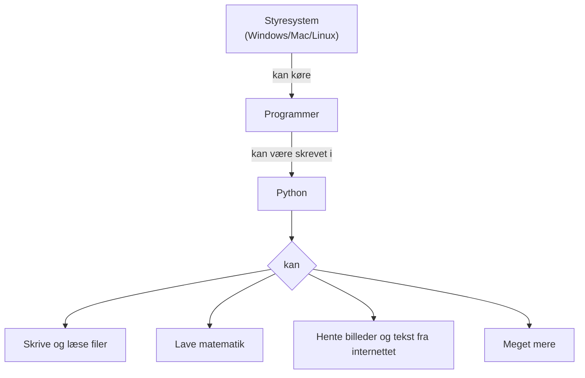

# Python og styresystemet



Et styresystem (engelsk: operating system) er den del i din computer der
sørger for at alting kører. Hvis du ikke havde et styresystem, ville du
ikke kunne gå på internettet eller overhovedet skrive noget med dit
tastatur.

Python er et programmeringssprog.

I denne workshop vil vi lave forskellige Python-projekter der handler om
at bruge styresystemet.

For at kunne lave projekterne er det nødvendigt at lære noget
grundlæggende Python.  Det vil vi gøre i løbet af projekterne.


## Projekt: Lav din egen Google-søgemaskine

Emner: webcrawling, tekstbehandling, filer

Python-dokumentation:
  - [String Methods](https://docs.python.org/3/library/stdtypes.html#string-methods): Funktioner til at ændre tekst.

Python-pakker:
  - [urllib.request](https://docs.python.org/3/library/urllib.request.html): Kode til at lave forespørgsler over nettet.

Startkode:

```python
import urllib.request
```

## Projekt: Generér en hjemmeside til at vise billeder

Emner: HTML, billedformater, filer

Python-dokumentation:
  - [Format String Syntax](https://docs.python.org/3/library/string.html#formatstrings): En smart måde at sætte variabler ind i tekst.

Python-pakker:
  - [Pillow](https://pillow.readthedocs.io/en/stable/index.html): Kode til at arbejde med billeder.

Startkode:

```python
import os.path
```

## Projekt: Komprimering og kryptering

Emner: matematik, bytes, filer

Python-dokumentation:
  - [Binary Sequence Types](https://docs.python.org/3/library/stdtypes.html#binary-sequence-types-bytes-bytearray-memoryview): Pythons måde at håndtere low-level bytes på.

```python
import sys
```
