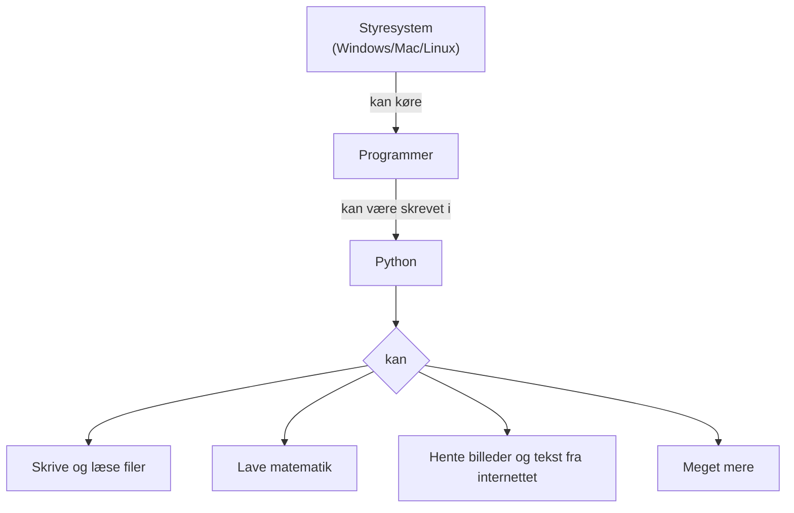

# Python og styresystemet

Et styresystem (engelsk: operating system) er den del i din computer der
sørger for at alting kører. Hvis du ikke havde et styresystem, ville du
ikke kunne gå på internettet eller overhovedet skrive noget med dit
tastatur.

Python er et programmeringssprog.

I denne workshop vil vi lave forskellige Python-projekter der handler om
at bruge styresystemet.

For at kunne lave projekterne er det nødvendigt at lære noget
grundlæggende Python.  Det vil vi gøre i løbet af projekterne.

## Projekt: Lav din egen Google-søgemaskine

Koncepter: webcrawling, tekstbehandling, filer

Python-bibliotek: [requests](https://docs.python-requests.org/en/latest/index.html)

## Projekt: Generér en hjemmeside til at vise billeder

Koncepter: HTML, billedformater, filer

## Projekt: Komprimering og kryptering

Koncepter: tekst, matematik, filer
